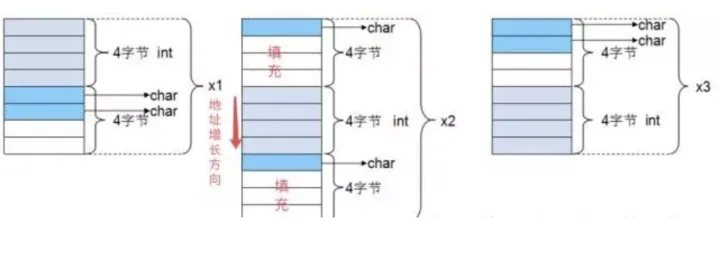

# 内存对齐

## 什么是内存对齐
还是用一个例子带出这个问题，看下面的小程序，理论上，32位系统下，int占4byte，char占一个byte，那么将它们放到一个结构体中应该占4+1=5byte；但是实际上，通过运行程序得到的结果是8 byte，这就是内存对齐所导致的。

```c
//32位系统
#include<stdio.h>
struct{
    int x;
    char y;
}s;

int main()
{
    printf("%d\n",sizeof(s);  // 输出8
    return 0;
}
```

现代计算机中内存空间都是按照 byte 划分的，从理论上讲似乎对任何类型的变量的访问可以从任何地址开始，但是实际的计算机系统对基本类型数据在内存中存放的位置有限制，它们会要求这些数据的首地址的值是某个数k（通常它为4或8）的倍数，这就是所谓的内存对齐。

## 为什么要进行内存对齐
尽管内存是以字节为单位，但是大部分处理器并不是按字节块来存取内存的.它一般会以双字节,四字节,8字节,16字节甚至32字节为单位来存取内存，我们将上述这些存取单位称为内存存取粒度.

现在考虑4字节存取粒度的处理器取int类型变量（32位系统），该处理器只能从地址为4的倍数的内存开始读取数据。

假如没有内存对齐机制，数据可以任意存放，现在一个int变量存放在从地址1开始的联系四个字节地址中，该处理器去取数据时，要先从0地址开始读取第一个4字节块,剔除不想要的字节（0地址）,然后从地址4开始读取下一个4字节块,同样剔除不要的数据（5，6，7地址）,最后留下的两块数据合并放入寄存器.这需要做很多工作.


现在有了内存对齐的，int类型数据只能存放在按照对齐规则的内存中，比如说0地址开始的内存。那么现在该处理器在取数据时一次性就能将数据读出来了，而且不需要做额外的操作，提高了效率。


## 内存对齐规则
每个特定平台上的编译器都有自己的默认“对齐系数”（也叫对齐模数）。gcc中默认#pragma pack(4)，可以通过预编译命令#pragma pack(n)，n = 1,2,4,8,16来改变这一系数。

__有效对其值__：是给定值`#pragma pack(n)`和`结构体中最长数据类型长度`中较小的那个。有效对齐值也叫 __对齐单位__。

了解了上面的概念后，我们现在可以来看看内存对齐需要遵循的规则：

1. 结构体第一个成员的偏移量（offset）为0，以后每个成员相对于结构体首地址的 offset，都是该成员大小与有效对齐值中较小那个的整数倍，如有需要编译器会在成员之间加上填充字节。

2. 结构体的总大小为 __有效对齐值__ 的整数倍，如有需要编译器会在最末一个成员之后加上填充字节。

下面给出几个例子以便于理解：

```c
//32位系统
#include<stdio.h>
struct
{
    int i;    
    char c1;  
    char c2;  
}x1;

struct{
    char c1;  
    int i;    
    char c2;  
}x2;

struct{
    char c1;  
    char c2; 
    int i;    
}x3;

int main()
{
    printf("%d\n",sizeof(x1));  // 输出8
    printf("%d\n",sizeof(x2));  // 输出12
    printf("%d\n",sizeof(x3));  // 输出8
    return 0;
}
```

以上测试都是在Linux环境下进行的，linux下默认#pragma pack(4)，且结构体中最长的数据类型为4个字节，所以有效对齐单位为4字节，下面根据上面所说的规则以x2来分析其内存布局：

首先使用规则1，对成员变量进行对齐：
+ sizeof(c1) = 1 <= 4(有效对齐位)，按照1字节对齐，占用第0单元；
+ sizeof(i) = 4 <= 4(有效对齐位)，相对于结构体首地址的偏移要为4的倍数，占用第4，5，6，7单元；
+ sizeof(c2) = 1 <= 4(有效对齐位)，相对于结构体首地址的偏移要为1的倍数，占用第8单元；

然后使用规则2，对结构体整体进行对齐：

x2中变量i占用内存最大占4字节，而有效对齐单位也为4字节，两者较小值就是4字节。因此整体也是按照4字节对齐。由规则1得到x2占9个字节，此处再按照规则2进行整体的4字节对齐，所以整个结构体占用12个字节。

根据上面的分析，不难得出上面例子三个结构体的内存布局如下：


# #pragma pack(n)
不同平台上编译器的 pragma pack 默认值不同。而我们可以通过预编译命令#pragma pack(n), n= 1,2,4,8,16来改变对齐系数。

例如，对于上个例子的三个结构体，如果前面加上#pragma pack(1)，那么此时有效对齐值为1字节，此时根据对齐规则，不难看出成员是连续存放的，三个结构体的大小都是6字节。


如果前面加上#pragma pack(2)，有效对齐值为2字节，此时根据对齐规则，三个结构体的大小应为6,8,6。内存分布图如下：


# 参考资料
https://zhuanlan.zhihu.com/p/30007037